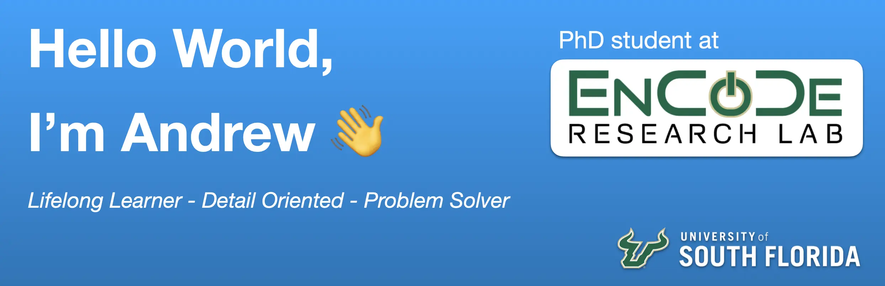

<!-- Header Image Goes Here -->

# -- About --

- I am an incoming Computer Science PhD student for Fall 2025 at the [Bellini College of Artificial Intelligence, Cybersecurity and Computing](https://www.usf.edu/ai-cybersecurity-computing/) at the University of South Florida ([USF](https://www.usf.edu)).
- I will be a member of The Engaging Computing Design ([EnCoDe](https://encoderesearchlab.org)) Research Lab, led by [Dr. Julia Woodward](https://juliawoodward.wordpress.com/about-me/).
- I am highly interested in Human-Computer Interaction ([HCI](https://en.wikipedia.org/wiki/Human–computer_interaction)), Virtual Reality ([VR](https://en.wikipedia.org/wiki/Virtual_reality)), Augmented Reality ([AR](https://en.wikipedia.org/wiki/Augmented_reality)), and Extended Reality ([XR](https://en.wikipedia.org/wiki/Extended_reality)).

 

# -- Tools I Use as an HCI Researcher --

I work where design, data, and emerging technologies meet. These are the tools I use regularly for research, prototyping, experimentation, and deployment.

  <strong>🔬 Research</strong>
  

  <strong>💻 Programming</strong>
  
  
  
  
  

  <strong>🗄️ Data</strong>
  
  

  <strong>🎨 Design</strong>
  
  
  
  

  <strong>🎮 Interactive</strong>
  
  

  <strong>🧰 Workflow</strong>
  
  
  
  

 

# -- Stats --

  

<!--
**AndrewUSF/AndrewUSF** is a ✨ _special_ ✨ repository because its `README.md` (this file) appears on your GitHub profile.

Here are some ideas to get you started:

- 🔭 I’m currently working on ...
- 🌱 I’m currently learning ...
- 👯 I’m looking to collaborate on ...
- 🤔 I’m looking for help with ...
- 💬 Ask me about ...
- 📫 How to reach me: ...
- 😄 Pronouns: ...
- ⚡ Fun fact: ...
-->
